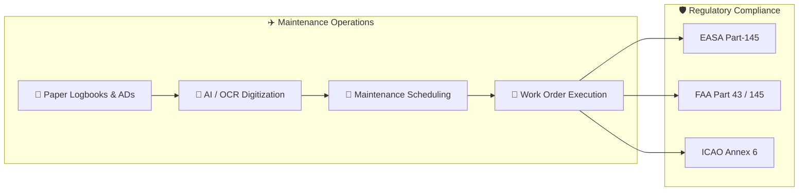

# ✈️ Awesome Aircraft Maintenance Management

  
  
  
  
  

  

---

## 📌 Overview & Scope

Welcome to the definitive, SEO-optimized directory of **Aircraft Maintenance Management Software**, **Aviation MRO Systems**, **CAMO Compliance Platforms**, and **Open-Source Flight Logbook Digitizers**. 

Whether you manage a commercial airline fleet, an FAA/EASA Part 145 repair station, a defense aviation unit, or a General Aviation (GA) aircraft, this curated guide breaks down leading **commercial SaaS solutions** and active **open-source projects**.

---

## 📑 Table of Contents

- [📈 Sector Market Size \& Dynamics](#-sector-market-size--dynamics)
- [🏢 SaaS \& Enterprise Hosted Platforms](#-saas--enterprise-hosted-platforms)
- [💻 Open-Source GitHub Projects](#-open-source-github-projects)
- [🎯 Key Feature Comparison Matrix](#-key-feature-comparison-matrix)
- [💡 How to Choose an Aircraft Maintenance System](#-how-to-choose-an-aircraft-maintenance-system)
- [🤝 How to Contribute](#-how-to-contribute)
- [❓ Frequently Asked Questions (FAQ)](#-frequently-asked-questions-faq)
- [⚖️ Regulatory Disclaimer](#-regulatory-disclaimer)

---

## 📈 Sector Market Size & Dynamics

> 📊 **Market Insights:** The global Aviation MRO (Maintenance, Repair, and Overhaul) Software market is currently valued at **~$9.75 Billion** and is projected to expand to **$11.7 Billion – $17.6 Billion by 2032–2034** (CAGR of **~5.2% – 6.8%**). The sector exhibits **moderate fragmentation**—featuring established enterprise software providers alongside specialized niche MRO developers rather than a winner-take-all monopoly.

---

## 🏢 SaaS & Enterprise Hosted Platforms

Below is the sorted list of top commercial SaaS aircraft maintenance platforms, ordered by **Company Size (Annual Revenue / Market Valuation) descending**:

| 🏢 Product & Platform | 📝 Description & Capabilities | 💰 Starting Pricing | 🎁 Free Tier / Free Trial Limit | 📊 Company Size (Rev / Valuation) |
| :--- | :--- | :--- | :--- | :--- |
| **[Lufthansa Technik (eMRO)](https://www.lufthansa-technik.com/emro)** | Enterprise digital MRO platform covering maintenance execution, engineering, and predictive maintenance for commercial airlines. | ~$2,500 / month (base facility tier) | 30-day enterprise sandbox demo (with sample fleet dataset) | **~$7.1 Billion** (€6.5B revenue) |
| **[IFS Maintenix](https://www.ifs.com/)** | Integrated aviation maintenance management suite with advanced supply chain and fleet planning for airlines & defense. | ~$1,800 / user / month | 14-day guided sandbox demo (up to 5 test seats) | **~$1.1 Billion** revenue ($10B+ Valuation) |
| **[CAMP Systems](https://www.campsystems.com/)** | Maintenance tracking, engine monitoring, and compliance suite for business jets, turboprops, and helicopters. | ~$150 / aircraft / month | 30-day trial for CAMP Flight Tracking (1 tail number limit) | **~$1.025 Billion** valuation ($3.8B parent HEICO) |
| **[TRAX eMRO](https://www.trax.aero/)** | Cloud-native MRO and fleet engineering software suite for commercial air carriers and third-party repair hubs. | ~$1,200 / month (base cloud module) | 30-day web portal trial for certified air carriers & MROs | **~$120 Million** valuation ($2.1B parent AAR Corp) |
| **[Veryon Tracking+](https://veryon.com/)** | Maintenance tracking and airworthiness directive (AD/SB) management for GA, corporate fleets, and rotorcraft. | ~$195 / aircraft / month | 14-day full-feature free trial (max 2 aircraft) | **~$120 Million** revenue ($500M Accel-KKR) |
| **[Ramco Aviation](https://www.ramco.com/aviation/)** | Full MRO, CAMO, flight ops, and defense aviation ERP package with AI-driven analytics. | ~$850 / module / month | 30-day test drive environment (up to 10 user logins) | **~$75 Million** annual revenue |
| **[AMOS by Swiss-AS](https://www.swiss-as.com/)** | Industry-standard MRO & CAMO software solution used by global airlines, MROs, and maintenance engineering teams. | ~$1,500 / month (base subscription) | 30-day interactive demo workspace for CAMO teams | **~$60 Million** annual revenue |
| **[Rusada ENVISION](https://www.rusada.com/)** | Flight operations, airworthiness tracking, and digital task card maintenance management platform. | ~$450 / user / month (min 5 users) | 14-day guided trial sandbox with sample maintenance task cards | **~$35 Million** unit revenue (CSU parent $70B+ MCap) |
| **[Corridor Aviation](https://www.corridor.aero/)** | Repair station CMMS and aviation shop software streamlining work orders, inventory, and FAA compliance. | ~$299 / tech / month | 14-day free trial (up to 3 technician accounts) | **~$25 Million** annual revenue |
| **[Quantum MX](https://www.quantummx.com/)** | Work order, FAA logbook, and inventory maintenance management tailored for GA shops and flight schools. | ~$79 / month flat rate | 30-day full-featured free trial (no credit card required) | **~$5 Million** annual revenue |

---

## 💻 Open-Source GitHub Projects

Explore community-driven, self-hosted, and transparent aviation maintenance repos sorted by **GitHub Star Count (descending)**. Every star badge links directly to the project's stargazers page:

| 🚀 Project Name | ⭐ GitHub Stars | 🧰 Tech Stack | 📄 Description & Aviation Use Case |
| :--- | :---: | :--- | :--- |
| **[Atlas CMMS](https://github.com/Grashjs/cmms)** |  | Spring Boot, React, Docker | GPLv3 self-hosted CMMS managing asset tracking, work orders, preventive maintenance, and inventory for aviation MRO facilities. |
| **[Web-Logbook](https://github.com/vsimakhin/web-logbook)** |  | Go, React, PostgreSQL | Self-hosted EASA-compliant digital flight and aircraft maintenance logbook with PDF export and maintenance interval alerts. |
| **[AeroBrief](https://github.com/tanay1337/AeroBrief)** |  | TypeScript, Node.js | All-in-one flight planning, weather aggregator, and flying maintenance record manager. |
| **[FlightLog](https://github.com/jstedfast/FlightLog)** |  | C#, .NET, SQLite | Lightweight private pilot logbook and aircraft inspection interval tracker for owner-maintained aircraft. |
| **[MyTailLog](https://github.com/iiamit/MyTailLog)** |  | Next.js, Supabase, AI | AI-powered paper logbook digitizer. Uses Anthropic vision to scan paper records, tracking ADs, 100-hr/annual inspections, and W&B. |
| **[OpenAirport](https://github.com/thunderai/openairport)** |  | PHP, MySQL | Modular airport computer maintenance & management system built specifically for FAA Part 139 airfield maintenance compliance. |
| **[Simple Aircraft Manager](https://github.com/marbindrakon/simple-aircraft-manager)** |  | Python, Django, HTML5 | Self-hosted tracker for flying clubs & owners. Manages component lifecycles, Airworthiness Directives (ADs), squawks, and inspections. |
| **[SlingologyMX](https://github.com/AlchemyGeek/SlingologyMX)** |  | Python, Flask, SQLite | Lightweight owner-centric web application for tracking light aircraft maintenance, equipment lists, and directive notifications. |
| **[FTU Maintenance Documentation](https://github.com/mckayERP/FTU_Maintenance_Documentation)** |  | ERPNext, Python | ERP-integrated maintenance documentation system designed for Flight Training Units (FTUs) and Canadian AMOs. |
| **[CSAT Maintenance Planner](https://github.com/kbss-cvut/csat-maintenance-planner)** |  | React, TypeScript, Docker | Visual maintenance planner developed for Czech Airlines Technics (CSAT) with Czech Technical University. |
| **[MSAT Tool](https://github.com/Rusty112358/MSAT)** |  | VB.NET, SQL | USAF Maintenance Scheduling Application Tool importing 200+ text reports for fleet configuration & maintenance scheduling. |
| **[SkyTrack](https://github.com/Anantha1605/SkyTrack)** |  | MySQL, PHP | Aviation database system tracking aircraft usage, crew assignments, and automated flight-hour maintenance alerts. |

---

## 🎯 Key Feature Comparison Matrix

| Feature Focus | 🏢 SaaS Enterprise Suites | 💻 Open-Source / Self-Hosted Tools |
| :--- | :--- | :--- |
| **Target Audience** | Commercial Airlines, Large MROs, Defense | GA Aircraft Owners, Flying Clubs, Small AMOs |
| **Compliance Support** | Automated FAA/EASA AD & SB updates | Manual or semi-automated entry / custom scripts |
| **Deployment Model** | Cloud SaaS (AWS/Azure) or Hybrid | Self-hosted Docker, Local server, SQLite/PostgreSQL |
| **Vendor Lock-in** | Proprietary databases & API connectors | Full access to source code and database schemas |
| **Upfront Cost** | $1,000 – $50,000+ annual subscriptions | $0 (Free open-source code) |

---

## 💡 How to Choose an Aircraft Maintenance System

When selecting an aircraft maintenance tracking platform:

1. 🛡️ **Verify Airworthiness Directive Integration**: Ensure the system automates or simplifies tracking of FAA ADs and manufacturer Service Bulletins (SBs).
2. 📱 **Mobile Work Card Support**: Technicians in the hangar benefit immensely from mobile offline access for signing off work orders.
3. 📦 **Inventory & Parts Traceability**: Look for FAA Form 8130-3 or EASA Form 1 digital record attachments for lot tracking.
4. 💸 **Total Cost of Ownership**: Evaluate per-tail vs per-user pricing models based on fleet scale.

---

## 🤝 How to Contribute

Contributions are welcome! Please follow these simple steps:

1. 🍴 Fork this repository.
2. 📝 Add or edit software entries in `README.md`.
3. 🔍 Ensure accurate pricing, free trial, star badges, and factual descriptions.
4. 🚀 Open a Pull Request with a clear summary of changes.

---

## ❓ Frequently Asked Questions (FAQ)

<b>1. What is Aircraft Maintenance Management Software (MRO Software)?</b>

Aircraft Maintenance Management Software (MRO/CAMO software) helps airlines, aircraft operators, and repair stations track scheduled maintenance, Airworthiness Directives (ADs), Service Bulletins (SBs), component hours/cycles, inventory, work orders, and technician sign-offs in accordance with aviation safety regulations.

<b>2. Can open-source software be used for FAA/EASA certified maintenance?</b>

Yes, provided the software maintains verifiable data integrity, audit logs, and compliant maintenance recordkeeping as mandated under FAA 14 CFR Part 43 / Part 145 or EASA Part-145 regulations. Open-source solutions like MyTailLog or Simple Aircraft Manager offer transparent data ownership ideal for GA and custom workflows.

<b>3. What is the difference between CAMO and MRO software?</b>

CAMO (Continuing Airworthiness Management Organisation) software focuses on airworthiness compliance, maintenance planning, and technical records oversight. MRO software focuses on hangar execution, shop floor work orders, inventory management, labor tracking, and billing.

---

## ⚖️ Regulatory Disclaimer

- This directory is **community-curated** for informational and educational purposes.
- All aircraft maintenance software used in operational environments must comply with relevant civil aviation authority regulations (e.g., FAA, EASA, Transport Canada, CASA).
- Always verify airworthiness data against official manufacturer maintenance manuals and regulatory directive publications.

---

  <b>Made with ❤️ for airlines, MROs, CAMOs, GA owners, and aviation software engineers worldwide.</b>

